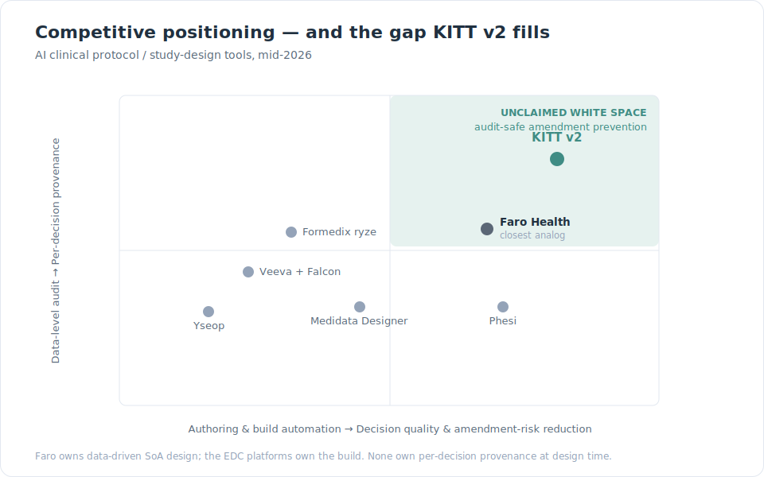
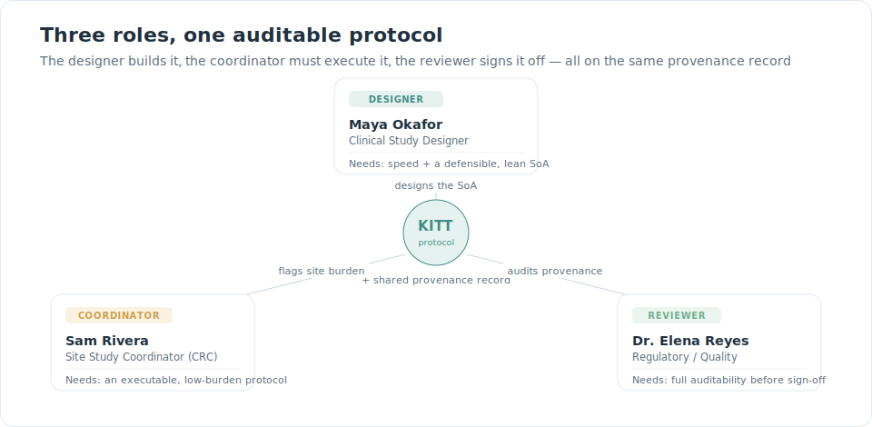
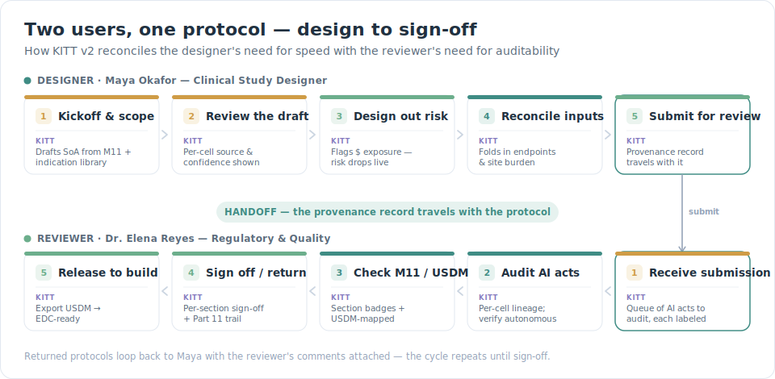
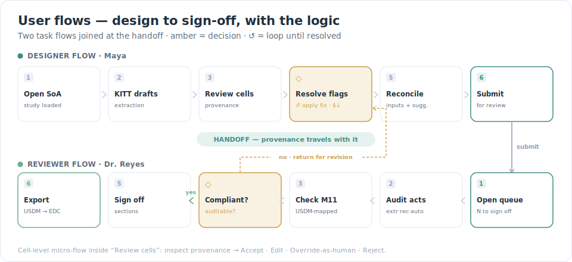
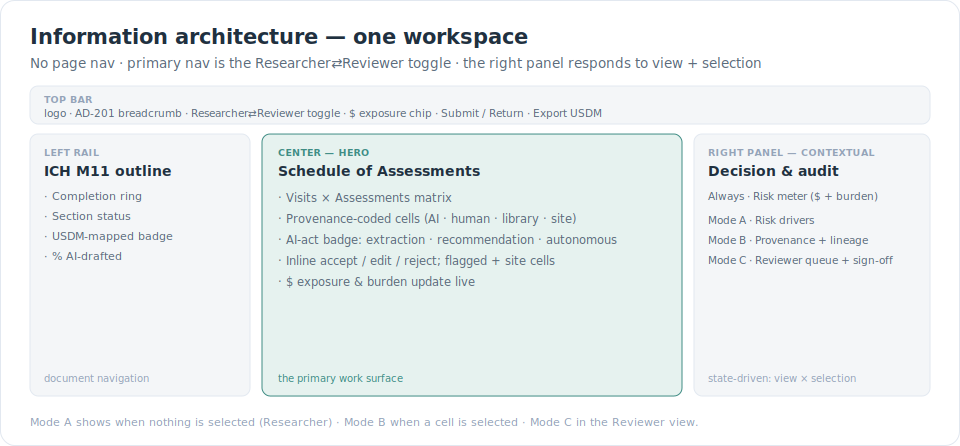
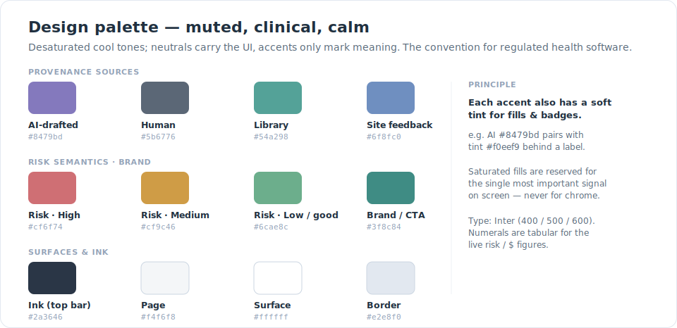

# KITT v2 — Case Study

**Audit-safe clinical protocol design.** An AI-assisted desktop workspace that reframes clinical study design from *"draft protocols faster"* to *"design protocols you won't have to amend — and prove exactly what the AI did."*

> **Type:** Portfolio prototype (enhanced rebuild of the original [KITT case study](https://www.davinces.design/work/kitt))
> **Platform:** Desktop web · React · Vite · Tailwind
> **Discipline:** Product strategy · UX research · interaction design · UI · front-end prototype

---

## TL;DR

The original KITT established a strong thesis — **AI-assisted speed that stays audit-safe**. This rebuild keeps that thesis and sharpens it with fresh market research:

- **The real cost isn't design time — it's amendments.** A substantial protocol amendment costs a median **$141K (Ph II) / $535K (Ph III)**, and **~45% are avoidable**. So we optimize for *amendment risk*, surfaced as a live dollar figure at design time.
- **Per-decision provenance is the unclaimed white space.** Competitors (Faro, Medidata, Veeva) automate authoring and build; none surface *per-cell, AI-vs-human provenance with a regulator-grade act taxonomy* at design time. That intersection is KITT v2's wedge.
- **The protocol is now a data object.** ICH M11 (finalized Nov 2025) + CDISC USDM make the protocol machine-readable and EDC-ready. KITT is built on that backbone.

**Core thesis:** *the auditability that satisfies the regulator is the same signal that prevents the amendment* — provenance and complexity-scoring are one system, not two features.

---

## 1. Background — the original KITT

The original KITT positioned itself on a single tension: **"Generic AI is fast but unauditable; legacy EDC/protocol tools are safe but manual."** Its wedge was *AI-assisted speed that stays audit-safe* — AI suggests, humans approve, AI output stays visually distinct. Two users with competing needs (a clinical researcher who wants speed, a regulatory reviewer who wants auditability) and headline outcomes of ~60% time reduction and ~25% NPS lift.

Strong foundation. This rebuild asks: *given everything that changed in the market in 2025–2026, what is the sharpest version of this idea?*

---

## 2. Market research

Conducted fresh (mid-2026) to anchor the rebuild in current ground truth rather than the original framing.

| Finding | Why it matters |
|---|---|
| A substantial amendment costs a median **$141K (Ph II) / $535K (Ph III)**; 57% of protocols get one and **~45% are avoidable**. Heavier schedules of assessments correlate with **3.2 amendments** vs 2.0 for lean ones. ([Tufts CSDD / Getz](https://link.springer.com/article/10.1177/2168479016632271)) | The money problem is *amendments*, not design time. The **Schedule of Assessments** is the lever — so it becomes the hero object. |
| **ICH M11 (CeSHarP)** was finalized **19 Nov 2025** — a harmonized, machine-readable protocol template accepted across FDA/EMA/PMDA. CDISC **USDM / Digital Data Flow** makes the protocol auto-configure downstream EDC/CTMS. ([FDA M11](https://www.fda.gov/regulatory-information/search-fda-guidance-documents/m11-template-clinical-electronic-structured-harmonised-protocol-cesharp), [CDISC DDF](https://www.cdisc.org/ddf)) | Anchor structure to M11; output USDM. The protocol is *born digital*. |
| FDA's Jan-2025 AI draft guidance + FDA/EMA's ten shared principles center on **credibility, risk-based context-of-use, and human oversight**. Sponsors should require *"traceable data lineage… know whether it is a recommendation, an extraction, or an autonomous classification."* ([FDA AI guidance](https://intuitionlabs.ai/articles/fda-ai-drug-development-guidance), [FDA/EMA principles](https://www.appliedclinicaltrialsonline.com/view/fda-ema-align-ten-principles-artificial-intelligence-use-drug-development)) | Auditability is a regulatory expectation. Provenance must be a first-class, *per-decision* artifact — and adopt the regulator's own vocabulary. |
| The market is racing toward **agentic authoring** (Medidata AI Study Build, Veeva Falcon / Agentic Authoring). ([Veeva Falcon](https://www.clinicaltrialvanguard.com/conference-coverage/veeva-unveils-falcon-ai-platform-and-agentic-authoring-at-2026-summit/)) | The frontier is no longer *"can AI draft it"* — it's *governance*. That's where KITT competes. |

### Competitive landscape

**Direct competitors** — AI-assisted protocol / study design:
- **Faro Health** — the closest analog. Study Designer maps the SoA to a CRF library, scores complexity against the **Tufts framework**, and has an AI Co-Author. Backed by BMS, Merck data. ([Faro](https://farohealth.com/study-designer/))
- **Medidata Designer / AI Study Build** — protocol → auto-configures Rave EDC; **Protocol Optimization** (ASCO 2025); only ODM-certified app generating structured protocol info.
- **Veeva Vault + Falcon AI** — enterprise RIM/CDMS; agentic authoring rolling out 2026–27.

**Adjacent specialists:** Phesi (data-driven design via RWD + digital twins), Yseop (regulatory-grade AI writing), Formedix ryze (CDISC metadata/build automation), Protocol Builder/BRANY (template authoring, no AI).

### Feature matrix

● strong  ◐ partial / emerging  ○ none / not a focus

| Capability | Faro | Medidata | Veeva+Falcon | Phesi | Yseop | Formedix | **KITT v2** |
|---|:--:|:--:|:--:|:--:|:--:|:--:|:--:|
| AI drafting / authoring | ● | ◐ | ● | ○ | ● | ○ | ● |
| **SoA-centric design** | ● | ◐ | ○ | ◐ | ○ | ◐ | ● |
| **Amendment-risk as $ exposure** | ◐ | ◐ | ○ | ◐ | ○ | ○ | ● |
| **Per-decision AI-vs-human provenance UX** | ◐ | ○ | ◐ | ○ | ◐ | ◐ | ● |
| ICH M11 / USDM native | ◐ | ◐ | ◐ | ○ | ◐ | ● | ● |
| Downstream EDC auto-config | ◐ | ● | ◐ | ○ | ○ | ● | ◐ |
| Primary buyer | Sponsor | Sponsor/CRO | Enterprise | Sponsor | Med/reg writing | Data-std teams | Coordinator + Reviewer |

*Audit trails today live at the **EDC/data layer** (Rave, Vault, 21 CFR Part 11) — not as a **design-time, per-cell** experience. Faro quantifies burden as participant-hours, not avoidable amendment dollars.*

### Positioning — and the white space

No competitor combines **SoA-centric design + amendment-risk-as-dollars + per-decision provenance**. That intersection is unclaimed.



---

## 3. Problem statement

The original framed the problem as *"design is slow and manual."* Research points to a higher-value framing:

> Clinical protocols are designed without visibility into the complexity that later forces **six-figure, mostly-avoidable amendments** — and now that AI can draft them in seconds, regulators require every AI contribution be **auditable to a documented standard.**

**The job-to-be-done** isn't *"draft faster."* It's *"help me ship a lean, M11-compliant protocol I won't have to amend — and prove to a reviewer exactly what the AI did."*

**Thesis:** the auditability that satisfies the regulator is the *same* signal that prevents the amendment. Provenance and complexity-scoring aren't two features — they're one system.

---

## 4. Target audience & personas

**Target audience:** sponsor and mid-size biotech study teams designing clinical trial protocols, plus the regulatory/quality reviewers who gate them and the investigative-site staff who execute them. Protocols are authored collaboratively (clinical scientist, medical writer, biostatistician, clin-ops) and signed off cross-functionally (Medical Affairs, Clinical Ops, Statistics, Regulatory Affairs, QA).

A research-rigor note: **the original case study conflated two people** — it called the primary user a "study coordinator" but described protocol *design* work, which is the clinical scientist's job. We separate them and give each a proper role.



### ① Maya Okafor — Clinical Study Designer / Protocol Lead → *the Researcher view*
- **Context:** Clinical scientist at a mid-size biotech; owns the Schedule of Assessments; designs 4–6 protocols/yr; lives in Word + Excel + last year's protocol.
- **Goals:** ship a scientifically sound, lean protocol fast; avoid downstream amendments; defend every design choice cross-functionally.
- **Frustrations:** stale templates; copy-paste errors; zero visibility into what complexity will *cost*; slow review ping-pong.
- **Moment of value:** the amendment-risk gauge falling as she applies AI fixes — watching cost get designed out in real time.

### ② Dr. Elena Reyes — Regulatory / Quality Reviewer → *the Reviewer view*
- **Context:** Regulatory Affairs / GCP-QA; the gate before a protocol is finalized; accountable to FDA/EMA and 21 CFR Part 11.
- **Goals:** confirm every AI contribution is traceable and human-approved; verify ICH M11 / USDM compliance; minimize regulatory risk.
- **Frustrations:** AI outputs she can't trace; black-box suggestions buried in tracked changes; fear of unauditable automation.
- **Moment of value:** per-cell lineage labeled *extraction / recommendation / autonomous classification* — trust made visible, not asserted.

### ③ Sam Rivera — Site Study Coordinator (CRC) → *represented, not a separate screen*
- **Context:** runs the visits day-to-day; the person who actually executes the SoA on real patients.
- **Relationship to the tool:** not an author — the **human cost of complexity**. Every redundant draw is their extra hour and their patient's dropout risk. Site staff are circulated drafts to catch operational blind spots.
- **In the product:** the **Patient & site burden** index is *their* metric; **site-feasibility feedback** becomes the 4th provenance source and a risk driver.

**Supporting cast (influencers):** the Biostatistician (sets endpoint anchors KITT reasons from), the Clinical Operations Lead (owns the burden the index speaks to), the Medical Writer (assembles the M11 narrative the USDM export feeds).

---

## 5. Solution definition

**Solution statement.** KITT v2 is a single-screen, desktop protocol-design workspace built on the **ICH M11 / CDISC USDM** backbone, where the **Schedule of Assessments is the hero object**. As the designer builds the SoA, KITT (a) drafts and labels every AI contribution with **regulator-grade provenance** (extraction / recommendation / autonomous classification), (b) continuously scores avoidable complexity as a **transparent dollar amendment-exposure estimate**, and (c) folds in **site-feasibility signals** that ground the coordinator's reality. The designer de-risks and submits; the reviewer audits the full provenance record and signs off or returns. One artifact — the provenance-bearing protocol — travels the whole loop.

**Design principles**
1. **Suggest, never auto-apply** — AI proposes; humans decide. *(carried from v1)*
2. **Provenance is an object, not a color** — every field carries source, act, evidence, confidence, lineage.
3. **Show the cost while the decision is reversible** — surface amendment exposure at design time.
4. **One protocol, two needs, one record** — speed and auditability reconciled through a shared trail.
5. **Standards as substrate** — M11 structure + USDM output; born-digital, EDC-ready.
6. **Ground the abstract in the human** — the burden index has a face (Sam); the dollar has a citation (Tufts).

**Four pillars:** ① Audit-safe AI · ② Amendment-risk intelligence · ③ Standards-native · ④ Reconciled handoff.

### How v2 improves on the original

| | Original KITT | **KITT v2** |
|---|---|---|
| **Optimizes for** | Design *speed* (days → hours) | **Amendment risk** — speed is a side effect |
| **AI governance** | Color-codes AI vs human | **Per-field provenance**: source, act, evidence, confidence, lineage |
| **Backbone** | Generic structured doc + wizard | **ICH M11 sections + USDM** → EDC-ready |
| **Hero object** | SoA reviewed line-by-line | **Interactive SoA matrix** + live amendment-risk gauge |
| **Two users** | Stated | **Switchable views** + a submit → audit → sign-off / return handoff |

---

## 6. User journeys & flows

The two personas sit at the two ends of the design pipeline. Their journeys connect at a single seam — **the handoff** — where speed hands off to auditability, with the provenance record as the baton.



The user flow adds the decision logic the journey abstracts — the two loops are load-bearing: Maya's **↺ apply-fix** loop (de-risk until the dollars stop dropping) and the **return-for-revision** loop (Elena bounces it back to *Reconcile*, not to square one).



**Cell-level micro-flow** (inside "Review cells"): inspect provenance → **Accept · Edit · Override-as-human · Reject.**

---

## 7. Information architecture

Deliberately flat — the architecture is *state*, not *pages*.



**Navigation model**
- **Primary nav = the persona toggle** (Researcher ⇄ Reviewer) — navigation by *who you are*, not by location.
- **Left rail = document navigation** within the M11 outline.
- **Right panel = state-driven** in three modes: Risk drivers (Researcher, nothing selected) → Provenance card (a cell selected) → Reviewer queue + sign-off (Reviewer view).

**Content / data model** — the provenance object is the spine:

```
Study (AD-201)
└─ Protocol — ICH M11
   ├─ Section [1…10]  { status, %AI-drafted, usdmMapped }
   └─ Schedule of Assessments
      ├─ Visit [SCR…FU]        { window, kind }
      ├─ Assessment [by domain] { label, m11Section }
      └─ Cell  (Assessment × Visit)            ◀ the atomic unit
         └─ Provenance {
              source : AI | Human | Library | Site     ← Sam adds the 4th
              act    : Extraction | Recommendation | Autonomous classification
              status : suggested | accepted | edited
              confidence, evidence, lineage[]
            }

Amendment-risk model
├─ Flag [{ severity, kind: autonomous | site, $exposure, basis(Tufts), targets[] }]
├─ Exposure   = Σ open-flag $   (labeled "est.")
└─ Burden index = Σ procedures → site-hours (Sam)

Audit trail   [ Event { actor, action, target, timestamp } ]
App state     view: Researcher | Reviewer · handoff: draft | submitted | returned | signed
```

Two things matter here: `source` gaining a 4th value (**Site**) is Sam's entire footprint — no new screen, just a richer atom. And `act` is a **separate axis** from `source` — which is exactly what lets the reviewer answer the regulator's question *per field*.

---

## 8. UI design decisions

### Color
Clinical and regulated software leans on **soft, desaturated cool neutrals** (slate, ice-grey, sage) with accents used sparingly for key metrics only — bright fills read as visual noise and erode trust. ([Healthcare UI](https://www.eleken.co/blog-posts/user-interface-design-for-healthcare-applications), [enterprise color tokens](https://www.aufaitux.com/blog/color-tokens-enterprise-design-systems-best-practices/))

So neutrals carry the UI, every accent is muted (violet → periwinkle, teal → muted teal, rose/amber/green → clay/ochre/sage), and the top bar is a soft slate rather than near-black. Each accent has a soft tint for fills and badges; saturated fills are reserved for the single most important signal on screen.



### Type
**Inter** (weights 400/500/600). Live figures (risk index, dollar exposure, burden) use **tabular numerals** so they don't jitter as they animate.

### Component patterns
- **Provenance cell** — the atomic unit. A colored chip by source; a corner alert when flagged; a small site-feedback dot when the coordinator has commented. Selecting it opens the provenance card.
- **AI-act badge** — Extraction / Recommendation / Autonomous classification, each with a scrutiny level, mapping the regulator's vocabulary onto the UI.
- **Amendment-risk gauge** — a muted semicircular gauge + transparent dollar exposure with the Tufts basis stated inline (honest estimate, not false precision).
- **Guided-flow bar** — a six-step stepper that walks the end-to-end path, auto-advancing as the user acts and telling them when to switch personas.

### Motion
Restrained and meaningful: a subtle **scanner sweep** in the logo (a nod to the name; signals "AI is reading"), a gentle **pulse** on pending AI suggestions, and a smooth **gauge transition** so the risk score visibly falls as fixes are applied. Nothing decorative.

### Accessibility
Muted accents are paired with text labels and icons, never color alone (e.g., flagged cells carry an alert glyph; sources carry labels in the card). Tabular numerals and generous hit targets support scanning and clicking in a dense matrix.

---

## 9. The prototype

A working desktop prototype (React · Vite · Tailwind v4) with synthetic data — a Phase II early-Alzheimer's protocol.

**What's interactive, end-to-end:**
1. **Resolve drivers** — Apply fix on each risk driver → exposure runs **$360K → $0**, gauge **80 → 34**.
2. **Decide suggestions** — accept / reject each pulsing AI cell.
3. **Submit for review** — hands off and switches to the Reviewer.
4. **Clear the queue** — the Reviewer approves each pending AI act (autonomous classifications + recommendations).
5. **Sign off** — sign off the M11 sections → status becomes *Signed off*, unlocking Export.
6. **Export USDM** — downloads the machine-readable payload; the guide reads *flow complete*.

A **guided-flow bar** narrates the whole path and a **Reset** replays it.

**Run it:**
```bash
npm install
npm run dev      # http://localhost:5173
```

---

## 10. Outcomes & reflection

**Reframed value.** The original measured *time saved*. v2 measures **avoidable amendment dollars** — a sharper, higher-stakes number that competitors don't lead with, grounded in a citable Tufts basis rather than false precision.

**The defensible insight.** The auditability the regulator demands and the complexity signal that prevents the amendment are the *same system*. Provenance isn't compliance overhead — it's the mechanism that makes the protocol leaner.

**Roadmap.** Collaborative multi-author editing & version control · richer site-feasibility loop (interactive coordinator feedback) · eligibility-criteria complexity scoring · real USDM round-trip into an EDC builder · multilingual protocol output.

---

*Prototype for portfolio demonstration. Not a medical device; not for use in real clinical study design. All data is synthetic.*
